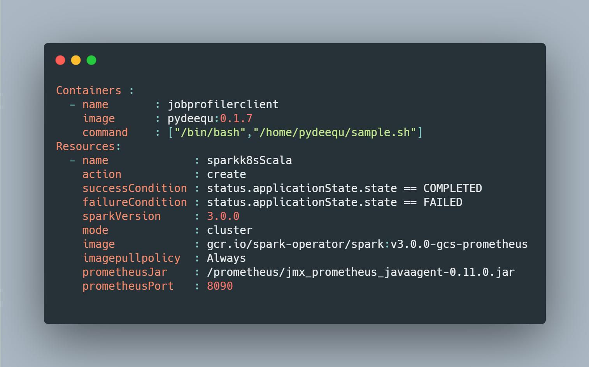
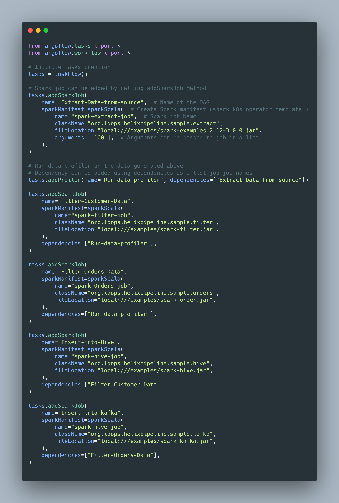
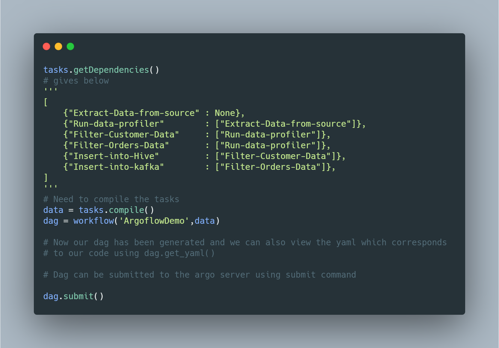
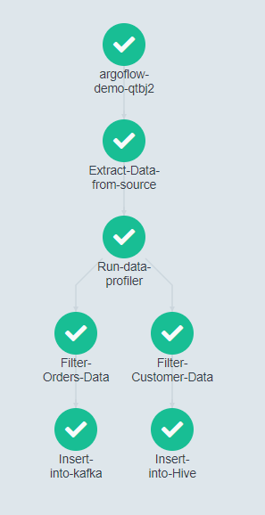

# Pipeline API

Argo Workflow automation is driven by yaml templates that are desined using the  ADSL (Argo Domain Specific Language). More examples for the same can be found [here](https://github.com/argoproj/argo-workflows/tree/master/examples)

Pipeline API  makes use of the Argo models defined in the [Argo Python client](https://github.com/argoproj-labs/argo-client-python) repository

## Why pipeline API

* Hide infrastructure/underlying image details from the end user
* Embedding python code into other existing automation scripts 

All the low level details regarding the image/container details are stored in yaml file

## Configuration file :

Config file contains mainly two components

* Containers : contains the pre built container images 
* Resources  : can contain any custom resource definition that needs to be implemented

Below is the sample yaml which contains `jobprofilerclient` to run a sample data profiler using [pydeequ](https://github.com/awslabs/python-deequ/) and resource template `sparkk8sScala` is to run a spark job using [Spark Operator](https://github.com/GoogleCloudPlatform/spark-on-k8s-operator)

## Usage 

A quick example to show how to complex DAG can be created 

Once tasks has been added , dag can be compiled and also we can view the dependencies once the dag is compiled , submit the dag to argo workflow

This code results in a DAG which looks like this when submitted to ArgoWorkflow

